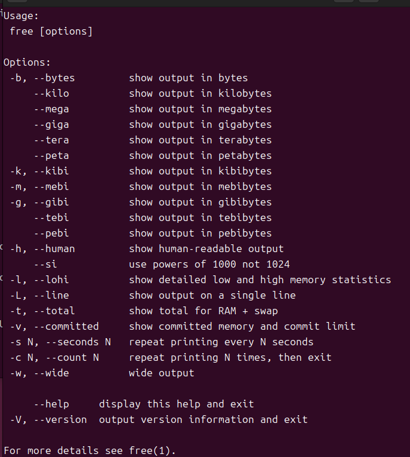
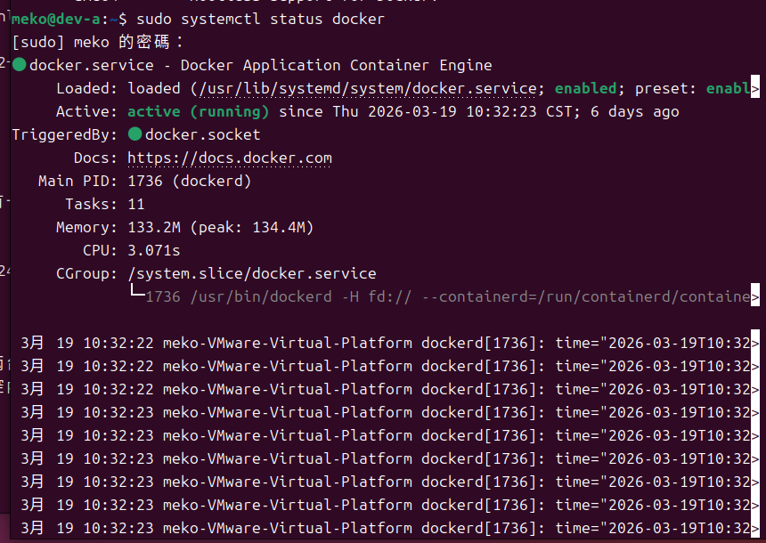
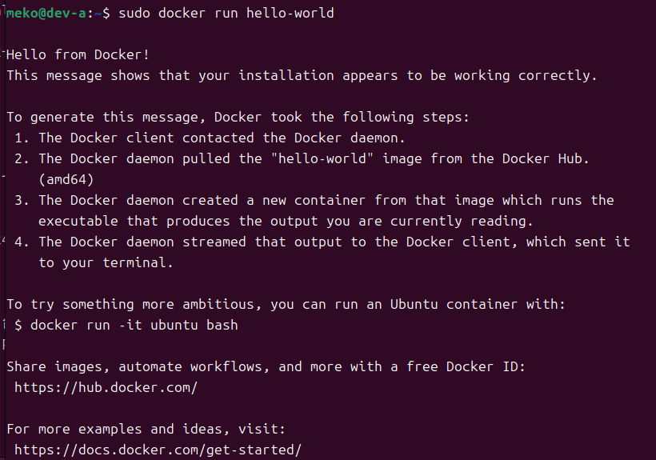
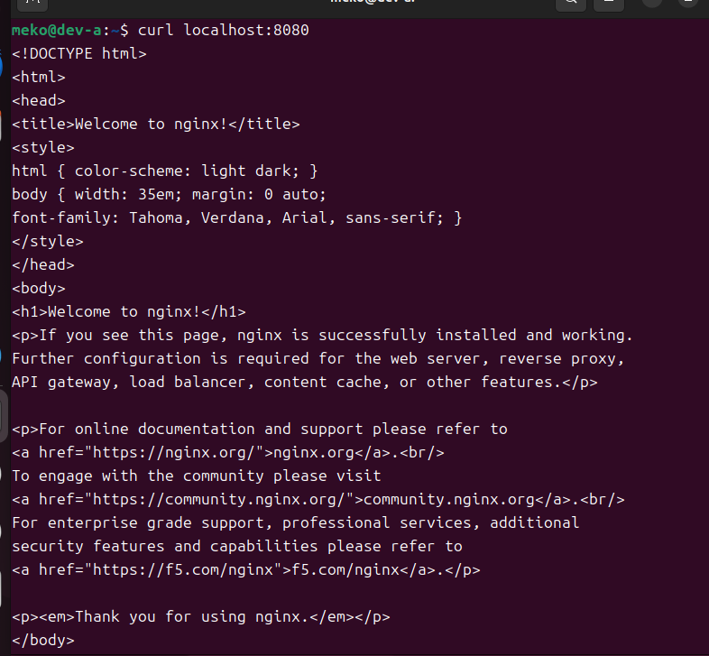
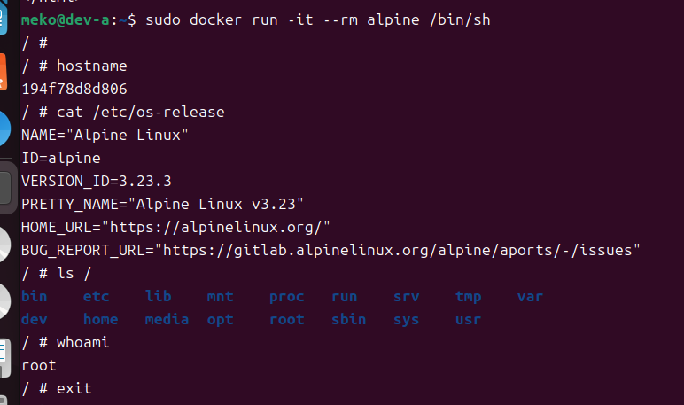

# W01｜虛擬化概論、環境建置與 Snapshot 機制

## 環境資訊
- Host OS：Windows 11
- VM 名稱：Ubuntu 24
- Ubuntu 版本：No LSB modules are available.
Distributor ID:	Ubuntu
Description:	Ubuntu 24.04.4 LTS
Release:	24.04
Codename:	noble

- Docker 版本：Docker version 29.3.0, build 5927d80
- Docker Compose 版本：Docker Compose version v5.1.0

## VM 資源配置驗證

| 項目 | VMware 設定值 | VM 內命令 | VM 內輸出 |
|---|---|---|---|
| CPU | 2 vCPU | `lscpu \| grep "^CPU(s)"` | lscpu: bad usage |
| 記憶體 | 4 GB | `free -h \| grep Mem` | （請看圖） |
| 磁碟 | 40 GB | `df -h /` | 檔案系統        容量  已用  可用 已用% 掛載點
/dev/sda2        30G   13G   16G   44% /|
| Hypervisor | VMware | `lscpu \| grep Hypervisor` | lscpu: bad usage |

## 四層驗收證據
- [ ] ① Repository：deb [arch=amd64 signed-by=/etc/apt/keyrings/docker.gpg]   https://download.docker.com/linux/ubuntu   noble stable
- [ ] ② Engine： ii  docker-ce                                      5:29.3.0-1~ubuntu.24.04~noble            amd64        Docker: the open-source application container engine
ii  docker-ce-cli                                  5:29.3.0-1~ubuntu.24.04~noble            amd64        Docker CLI: the open-source application container engine
ii  docker-ce-rootless-extras                      5:29.3.0-1~ubuntu.24.04~noble            amd64        Rootless support for Docker.

- [ ] ③ Daemon：`sudo systemctl status docker`顯 示 active

- [ ] ④ 端到端：`sudo docker run hello-world` 成功輸出

- [ ] Compose：Docker Compose version v5.1.0

## 容器操作紀錄
- [ ] nginx：6c19fc2d077f7227db2d4054791a2bdeca73fea2c062eda00385b6f8542b3d87 + `curl localhost:8080` 輸出

- [ ] alpine：`sudo docker run -it --rm alpine /bin/sh` 內部命令與輸出

- [ ] 映像列表：                                                           i Info →   U  In Use
IMAGE                ID             DISK USAGE   CONTENT SIZE   EXTRA
alpine:latest        25109184c71b       13.1MB         3.95MB        
hello-world:latest   85404b3c5395       25.9kB         9.52kB        
nginx:latest         7150b3a39203        240MB         65.8MB    U   

## Snapshot 清單

| 名稱 | 建立時機 | 用途說明 | 建立前驗證 |
|---|---|---|---|
| clean-baseline | 虛擬機系統剛裝好 | 最乾淨的系統環境，為最開始的狀態 |`hostnamectl`` ip route` `sudo docker --version` `docker compose version` `sudo systemctl status docker --no-pager` `sudo docker run --rm hello-world` |
| docker-ready | 完成docker的安裝與測試後 | 可以作為使用docker的作業環境 | `sudo systemctl status docker --no-pager` `sudo docker run --rm hello-world` `sudo docker images` |

## 故障演練三階段對照

| 項目 | 故障前（基線） | 故障中（注入後） | 回復後 |
|---|---|---|---|
| docker.list 存在 | 是 | 否 | 是 |
| apt-cache policy 有候選版本 | 是 | 否 | 是 |
| docker 重裝可行 | 是 | 否 | （填入） |
| hello-world 成功 | 是 | N/A | （填入） |
| nginx curl 成功 | 是 | N/A | （填入） |

## 手動修復 vs Snapshot 回復

| 面向 | 手動修復 | Snapshot 回復 |
|---|---|---|
| 所需時間 | 40秒 | 10秒 |
| 適用情境 | 明確了解目前問題的情況 | 無法搞定問題或已經崩潰 |
| 風險 | 可能會有誤判或沒修正的地方 | 之前所做的東西全部回歸到快照保存的時候 |

## Snapshot 保留策略
- 新增條件：當完成一個階段且驗證成功
- 保留上限：最多保留3~5個有在使用的Snapshot，但至少要保留clean-baseline(系統基準)與docker-ready(工作環境)
- 刪除條件：確認已經有新的快照備份且舊的已經不需要時，刪除最舊的

## 最小可重現命令鏈
` # 故障前基線
echo "=== 故障前 ==="
ls /etc/apt/sources.list.d/
apt-cache policy docker-ce | head -10 `

` # 注入故障
sudo mv /etc/apt/sources.list.d/docker.list /etc/apt/sources.list.d/docker.list.broken
sudo apt update `

` echo "=== 故障中 ==="
ls /etc/apt/sources.list.d/
apt-cache policy docker-ce | head -10
sudo apt -y install docker-ce 2>&1 | tail -5 `

` sudo mv /etc/apt/sources.list.d/docker.list.broken /etc/apt/sources.list.d/docker.list
sudo apt update
apt-cache policy docker-ce | head -5 `

` echo "=== 回復後 ==="
ls /etc/apt/sources.list.d/
cat /etc/apt/sources.list.d/docker.list
sudo apt update `

` sudo systemctl status docker --no-pager
sudo docker --version
docker compose version
sudo docker run --rm hello-world
sudo docker images `

`free -h
df -h / `

` sudo docker run -d --name test-nginx -p 8080:80 nginx:latest
curl http://localhost:8080
sudo docker stop test-nginx
sudo docker rm test-nginx `

## 排錯紀錄
- 症狀：docker.list 不存在，apt-cache policy無候選板本
- 診斷：`ls /etc/apt/sources.list.d/` 
`apt-cache policy docker-ce | head -10`
- 修正：`sudo mv /etc/apt/sources.list.d/docker.list.broken/etc/apt/sources.list.d/docker.list`
`sudo apt update`
`apt-cache policy docker-ce | head -5`
 - 驗證：使用診斷的指令查看docker.list是否存在，apt-cache policy有候選版本

## 設計決策
Hypervisor的Type 1（Bare-metal Hypervisor)與Type 2（Hosted Hypervisor）選擇，前者因直接安裝在實體硬體上，不需要先有作業系統所以效能高、延遲低，後者是安裝在現有作業系統之上，像一般應用程式一樣執行所以效能略低。課堂上選擇Type 2是因為學生可以在自己電腦上安裝，不需要專用伺服器硬體，在教學的環境只需要一致與可回覆，不需一定要最高的效能。
