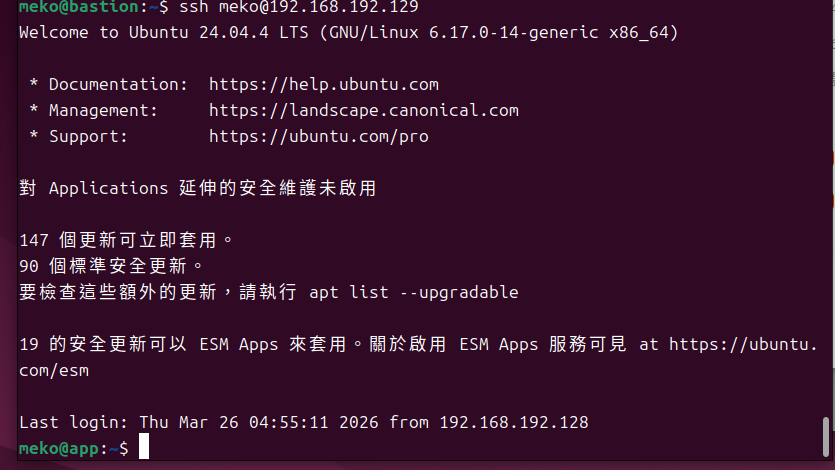
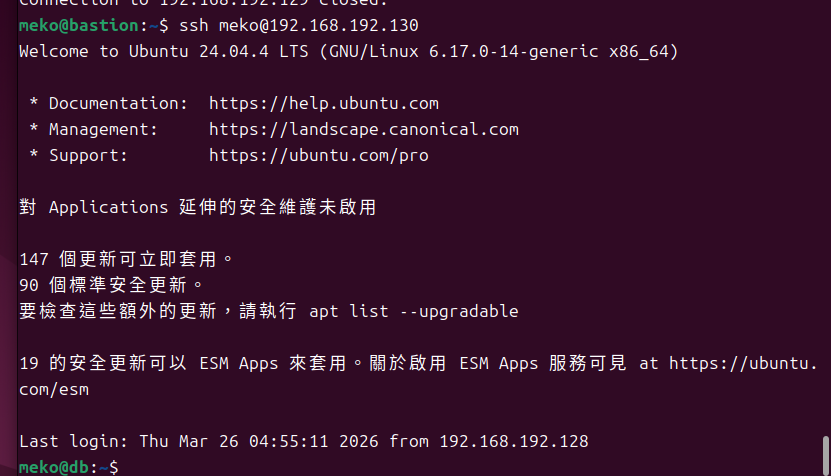
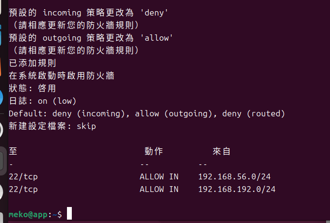
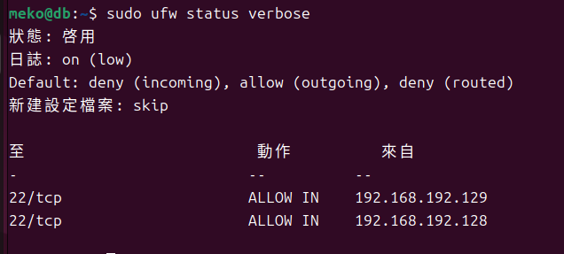
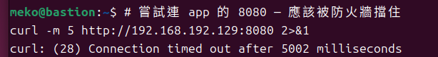
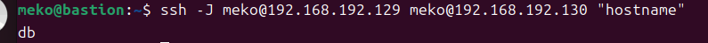
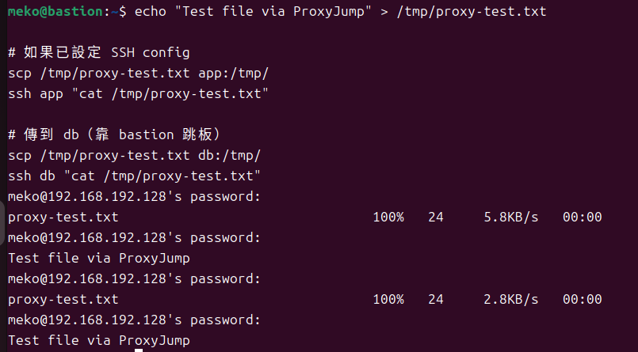
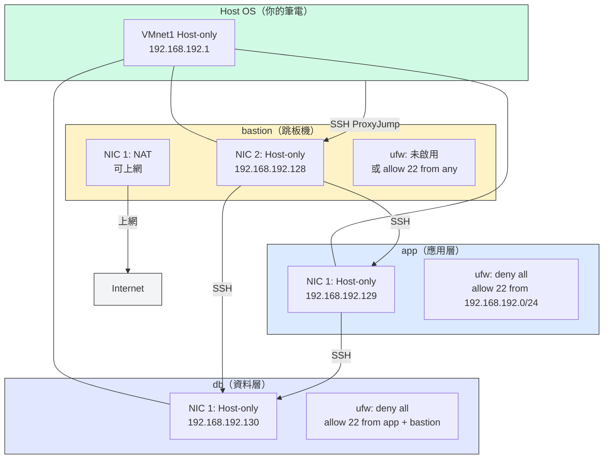

# W03｜多 VM 架構：分層管理與最小暴露設計

## 網路配置

| VM | 角色 | 網卡 | 模式 | IP | 開放埠與來源 |
|---|---|---|---|---|---|
| bastion | 跳板機 | NIC 1 | NAT | 192.168.245.136 | SSH from any |
| bastion | 跳板機 | NIC 2 | Host-only | 192.168.192.128 | — |
| app | 應用層 | NIC 1 | Host-only | 192.168.192.129 | SSH from 192.168.56.0/24 |
| db | 資料層 | NIC 1 | Host-only | 192.168.192.130 | SSH from app + bastion |

## SSH 金鑰認證

- 金鑰類型：ed25519
- 公鑰部署到：app 和 db 的 ~/.ssh/authorized_keys
- 免密碼登入驗證：
  - bastion → app：（貼上輸出）
  
  

  - bastion → db：（貼上輸出）
  
  

## 防火牆規則

### app 的 ufw status
（貼上 `sudo ufw status verbose` 輸出）

### db 的 ufw status
（貼上 `sudo ufw status verbose` 輸出）

### 防火牆確實在擋的證據
（貼上步驟 13 的 curl 8080 失敗輸出）

## ProxyJump 跳板連線
- 指令：（貼上你使用的 ssh -J 或 ssh config 設定）
從bastion靠 app 跳到 db
`ssh -J meko@192.168.192.129 meko@192.168.192.130 "hostname"`
- 驗證輸出：（貼上連線成功的 hostname 輸出）

- 

- SCP 傳檔驗證：（貼上結果）

## 故障場景一：防火牆全封鎖

| 項目 | 故障前 | 故障中 | 回復後 |
|---|---|---|---|
| app ufw status | active + rules | deny all | active + rules |
| bastion ping app | 成功 | **timed out** | 成功 |
| bastion SSH app | 成功 | **timed out** | 成功 |

## 故障場景二：SSH 服務停止

| 項目 | 故障前 | 故障中 | 回復後 |
|---|---|---|---|
| ss -tlnp grep :22 | 有監聽 | 無監聽 | 有監聽 |
| bastion ping app | 成功 | 成功 | 成功 |
| bastion SSH app | 成功 | **refused** | 成功 |

## timeout vs refused 差異
（用自己的話說明兩種錯誤的差異、各自指向什麼排錯方向）

timeout是連不到，通常是防火牆或網路的問題
refused是有連上了但不給進被拒絕，通常是ssh服務沒開
## 網路拓樸圖
（嵌入或連結 network-diagram）

## 排錯紀錄
- 症狀：SSH 出現 "Connection refused"
- 診斷：使用 `ss -tlnp | grep :22` 發現 port 22 沒有在監聽，確認是 SSH 服務未啟動（L4 問題）。
- 修正：執行 `sudo systemctl start ssh` 與 `sudo systemctl start ssh.socket`，
重新啟動 SSH 服務。
- 驗證：再次使用 `ss -tlnp | grep :22` 確認 port 22 已監聽，
並成功從 bastion SSH 連線到 app。

## 設計決策
（說明本週至少 1 個技術選擇與取捨，例如：為什麼 db 允許 bastion 直連而不是只允許從 app 跳？）
為什麼 db 允許 bastion 直連而不是只允許從 app 跳？
1. 管理便利性：
若db僅允許app存取，當需要維護時，必須先登入app再跳轉至db，會多一個步驟。
2. 彈性與可用性：
允許直連db，可在app發生問題時仍能直接維護db。
