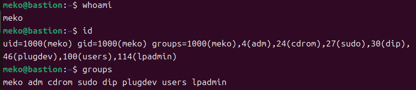
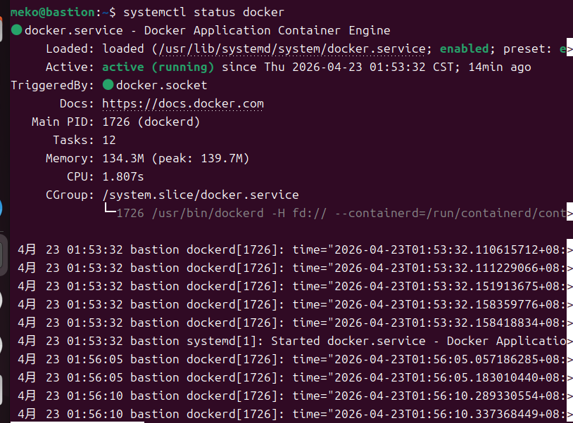

# W04｜Linux 系統基礎：檔案系統、權限、程序與服務管理

## FHS 路徑表

| FHS 路徑 | FHS 定義 | Docker 用途 |
|---|---|---|
| /etc/docker/ | 系統級設定檔 | daemon.json（Docker daemon 設定） |
| /var/lib/docker/ | 程式的持久性狀態資料 | 映像、容器、volumes |
| /usr/bin/docker | 使用者可執行檔 | Docker CLI 工具 |
| /run/docker.sock | 執行期暫存（PID/socket） | Docker daemon 的 Unix socket |

## Docker 系統資訊

- Storage Driver：overlayfs
- Docker Root Dir：/var/lib/docker
- 拉取映像前 /var/lib/docker/ 大小：284K
- 拉取映像後 /var/lib/docker/ 大小：288K
## 權限結構

### Docker Socket 權限解讀
（貼上 `ls -la /var/run/docker.sock` 輸出，逐欄說明 owner/group/others 的權限）
- 輸出為: `srw-rw---- 1 root docker 0 ... /var/run/docker.sock`
- 逐欄解讀：
  - `s`：檔案類型是 socket（不是普通檔案 `-`，也不是目錄 `d`）。
  - `rw-`：owner（root）有讀寫權限。
  - `rw-`：group（docker）有讀寫權限。
  - `---`：others 完全沒有權限。

### 使用者群組
（貼上 `id` 輸出，說明是否包含 docker 群組）



- 輸出中沒有 docker，使用者不在 docker 群組裡，無法直接存取 socket

### 安全意涵
（用自己的話說明為什麼 docker group ≈ root，安全示範的觀察結果）
- 只要把使用者加入 docker group，就可以不用 sudo 直接執行 docker run、docker ps 等指令。這代表該使用者具有與root用戶相同的權限。這意味著容器內的用戶可以執行所有系統命令，包括修改系統文件、安裝軟件包等。

## 程序與服務管理

### systemctl status docker
（貼上 `systemctl status docker` 輸出）




### journalctl 日誌分析
（貼上 `journalctl -u docker --since "1 hour ago"` 的重點摘錄，說明看到什麼事件）
```
Processing signal 'terminated'
Daemon shutdown complete
Stopped docker.service
```
- Docker 被關掉
```
Starting docker.service
Starting up
Loading containers: start.
```
- 系統重新啟動 Docker
```
Daemon has completed initialization
API listen on /run/docker.sock
Started docker.service
```
- Docker 初始化完成
### CLI vs Daemon 差異
（用自己的話說明兩者的差異，為什麼 `docker --version` 正常不代表 Docker 能用）

## 環境變數

- $PATH：`PATH:  /usr/local/sbin:/usr/local/bin:/usr/sbin:/usr/bin:/sbin:/bin:/usr/games:/usr/local/games:/snap/bin:/snap/bin
`
- which docker：`/usr/bin/docker`
- 容器內外環境變數差異觀察：容器內有自己獨立的環境變數，`$HOME`、`$PATH` 都和 Host 不同。容器是隔離的執行環境，不會繼承 Host 的 shell 設定

## 故障場景一：停止 Docker Daemon

| 項目 | 故障前 | 故障中 | 回復後 |
|---|---|---|---|
| systemctl status docker | active | inactive | active |
| docker --version | 正常 | 29.3.0 | 29.3.0 |
| docker ps | 正常 | Cannot connect | 正常 |
| ps aux grep dockerd | 有 process | 沒結果 | 有 process  |

## 故障場景二：破壞 Socket 權限

| 項目 | 故障前 | 故障中 | 回復後 |
|---|---|---|---|
| ls -la docker.sock 權限 | srw-rw---- | srw------- | srw-rw---- |
| docker ps（不加 sudo） | 正常 | permission denied | 正常 |
| sudo docker ps | 正常 | 正常 | 正常 |
| systemctl status docker | active | active | active |

## 錯誤訊息比較

| 錯誤訊息 | 根因 | 診斷方向 |
|---|---|---|
| Cannot connect to the Docker daemon | daemon 沒在跑 | `systemctl status docker` → 啟動 daemon |
| permission denied…docker.sock | daemon 有在跑但無權限去存取 | `ls -la /var/run/docker.sock` + `id` → 檢查權限/群組 |

（用自己的話說明兩種錯誤的差異，各自指向什麼排錯方向）

## 排錯紀錄
- 症狀：執行 `docker ps` 時出現` permission denied while trying to connect to the Docker API`;在停止Docker daemon後，出現 `Cannot connect to the Docker daemon`
- 診斷：使用 `systemctl status docker` 確認 Docker daemon 是否正在運行;`ls -la /var/run/docker.sock` 檢查 socket 權限;`id`確認目前使用者是否在 docker 群組中
- 修正：使用 `sudo systemctl start docker `重新啟動服務
- 驗證：`docker ps` 可正常列出容器，且使用 `systemctl status docker` 確認服務為 active。

## 設計決策
為什麼教學環境用 `usermod` 加 group 而不是每次 sudo？這個選擇的風險是什麼？
- 使用`usermod`將使用者加入docker群組，可以讓操作更便利能直接執行`docker run`、`docker ps`指令，不用每次都在前面打sudo。
- 風險則是由於 Docker daemon 是以 root 權限運行，加入group的使用者實際上擁有接近 root的控制能力，可以透過容器操作主機系統資源。而在正式環境需要控管group的成員避免未授權的人擁有過高的權限。
