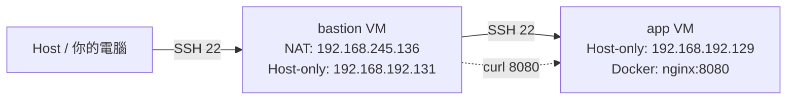
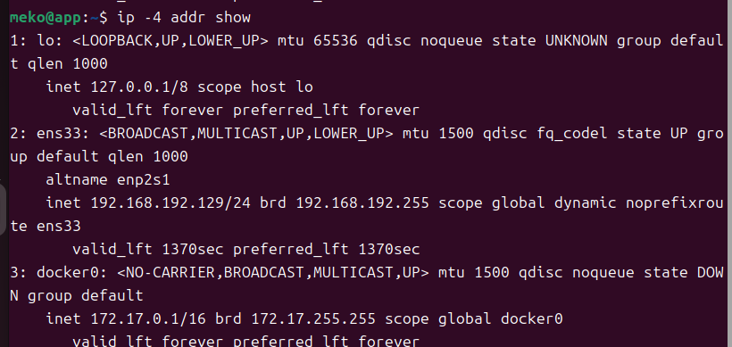
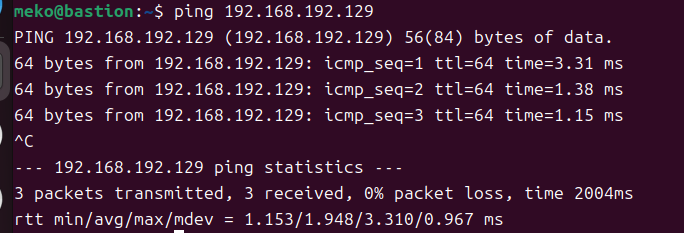
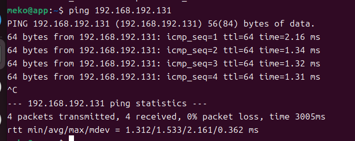
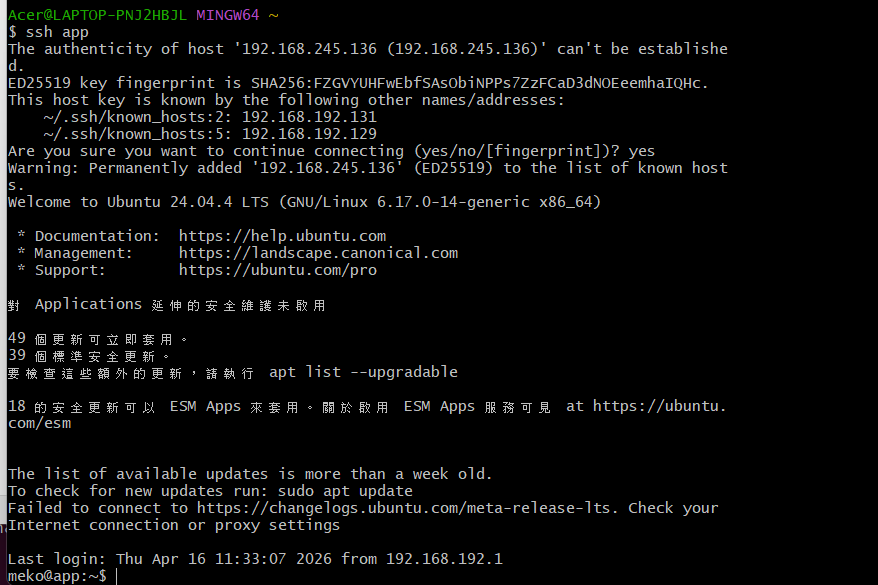
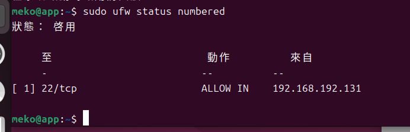
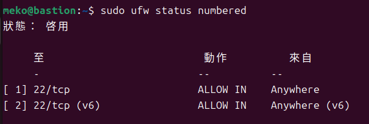

# 期中實作 — 411630279 林峰彬

## 1. 架構與 IP 
<Mermaid 圖 + 表格>


| VM | 網卡 | 模式 | IP | 用途 |
|---|---|---|---|---|
| bastion | NIC 1 | NAT | 192.168.245.136 | 上網 |
| bastion | NIC 2 | Host-only | 192.168.192.131 | 內網互連 |
| app | NIC 1 | Host-only | 192.168.192.129 | 內網互連 |

## 2. Part A：VM 與網路
<命令 + 關鍵輸出>
1.紀錄ip
```
ip -4 addr show
```
bastion:

app:

2.從bastion去ping app
```
ping 192.168.192.129
```


3.從app去ping bastion
```
ping 192.168.192.131
```


## 3. Part B：金鑰、ufw、ProxyJump
<防火牆規則表 + ssh app 成功證據>
```
ssh app
```





## 4. Part C：Docker 服務
<systemctl status docker + curl 輸出>

## 5. Part D：故障演練
### 故障 1：<F1/F2/F3 擇一>
- 注入方式：
- 故障前：
- 故障中：
- 回復後：
- 診斷推論：

### 故障 2：<另一個>
（同上）

### 症狀辨識（若選 F1+F2 必答）
兩個都 timeout，我怎麼分？

## 6. 反思（200 字）
這次做完，對「分層隔離」或「timeout 不等於壞了」的理解有什麼改變？

## 7. Bonus（選做）
